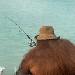

# Pixelifier - Pixelate images
 
## Command line arguments
### -i &lt;path/to/file&gt;
Use to specify image file.
### -c &lt;path/to/file&gt;
Use to specify colors file.
### -r &lt;width&gt;x&lt;height&gt;
Use to specify resolution. Both width and height need to be between 1 and 2048. The specified resolution will not exceed the dimensions of the source image. If no resolution is specified the source resolution will be used.
### -s
Save Pixelated image.
### -S
Save Pixelated_Colored image.
### -n
Keep the name of the source image in the filename when saving.
### -t
Print out the time it takes for certain operations during setup.
### -headless
Use to run the program without a window.
###
## Key bindings
### 1
Switch to "Normal" mode.
### 2
Switch to "Pixelated" mode.
### 3
Switch to "Pixelated_Colored" mode.
### F1
Toggle debug mode.
### F12
Take screenshot.
## Examples
### ./Pixelifier -i "example/serenity.jpg" -c "example/peanut_butter.txt"
An image and a colors file always need to be specified.
### ./Pixelifier -i "example/fishin.jpg" -c "example/ocean_sunset.txt" -r 128x128
This time the resolution is set to 128x128.
### ./Pixelifier -i "example/commute.jpg" -c "example/forest_magic.txt" -r 160x90 -s -S -n -t -headless
Now the program runs headless, meaning no window will be created. The program creates and saves the image both Pixelated and Pixelated_Colored. The filenames are a combination between the filename of the source image combined with the mode used. It also prints out the time it takes for each major operation to execute during setup.
## Notes
### Image file
From the SFML 2.6.0 wiki: 
"The supported image formats are bmp, png, tga, jpg, gif, psd, hdr, pic and pnm. Some format options are not supported, like jpeg with arithmetic coding or ASCII pnm."
### Colors file
The colors file is just a text file where each line represents a hex color. A line needs to start with a '#' and contain exactly 6 additional characters to be considered a valid color.
### Saves and screenshots
Saves are saved in a directory called "saves" which will be created (with force) if it doesn't exist. The same goes for screenshots, but in a directory called "screenshots".
### Bugs
There might be some bugs.
## About
Made for fun with

.
